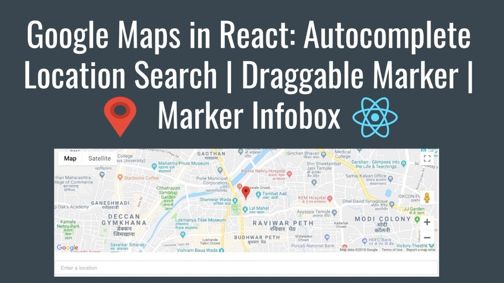

# Google Maps in React: Autocomplete Location Search | Draggable Marker | Marker Infobox

******* PLEASE STAR MY REPO TO SUPPORT ME 🙏 ******

Please follow me 🙏 on [twitter](https://twitter.com/imranhsayed) and github

## Description :clipboard:
> Demo App for Autocomplete Location Search, Draggable marker and Infobox using Google Maps API and React .



## Autocomplete Location Search Demo :video_camera:


## Drag the marker


## Use :point_right:

1. Get your API Key from [developers.google.com](https://developers.google.com/maps/documentation/javascript/get-api-key).
You can also watch tutorial to [Get API Key](https://www.youtube.com/watch?v=yhhkNtdg5x0&feature=youtu.be)
2. Add your Google Maps Key in `./client/src/client-config.js`

``` ruby
GoogleMapsAPI = 'xxxxx';

```

## Installation Instructions :wrench:

1. Clone the repo using `git clone https://github.com/imranhsayed/google-maps-in-react`
2. `cd google-maps-in-react`
3. `npm install`
4. `cd client`
5. `npm install`
7. `cd ..`
8. `npm run dev`

## Built With :zap:

1. Node
2. Express
3. React
4. Create React App
5. Google Maps API

## Tutorial Videos :video_camera:

* [Get API Key](https://www.youtube.com/watch?v=yhhkNtdg5x0&feature=youtu.be)
* [Autocomplete Location Search | Draggable Marker Part 1](https://youtu.be/4z4hxEHlsxc)
* [Autocomplete Location Search | Draggable Marker Part 2](https://youtu.be/xIYAV6IP4gA)

## Useful Links :link:

* [Autocomplete Location Search Blog](https://codeytek.com/google-maps-in-react-autocomplete-location-search-draggable-marker-marker-infobox/)

## License

[](http://badges.mit-license.org)

- **[MIT license](http://opensource.org/licenses/mit-license.php)**

